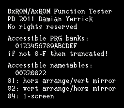

BxROM/AxROM function tester
===========================
By Damian Yerrick

Background
----------
Because the NES could see only about 32 KiB of ROM at once, NES Game
Pak circuit boards contained hardware called a "mapper" that would
control the upper address lines and let the CPU "turn the page" in
the game program.  PCBs during the NES era were limited in how
much ROM they supported because they only controlled a small number
of address lines.  For example, BNROM supported four 32 KiB pages for
a total of 128 KiB, while the AxROM family (AMROM, ANROM, and AOROM)
supported up to eight pages or 256 KiB.

NES emulators support an executable format called iNES whose header
specifies which mapper the game uses.  For example, AxROM is 7 and
BxROM is 34.  Many iNES mappers extend the classic discrete mappers
with additional upper address bits.  For example, most emulators
support at least 512 KiB of ROM for mappers 7 and 34.

The PowerPak is a CompactFlash adapter cartridge for the NES.  It
emulates the mapper and otherwise uses authentic NES hardware to
play the game.  As of PowerPak mappers 1.34, mapper 7 supports only
256 KiB, and mapper 34 supports only 128 KiB.

Test instructions
-----------------
Three test ROMs are included:

* bntest_v.nes: mapper 34, vertical mirroring
* bntest_h.nes: mapper 34, horizontal mirroring
* bntest_aorom.nes: mapper 7, one screen mirroring

Source code for use with ca65 is also included.

"Accessible PRG banks" contains sixteen digits.  Each represents the
result of an attempt to switch to that bank and read one byte.

* `0123456789ABCDEF` means all 512 KiB of the ROM is available
* `0123456701234567` means only the first 256 KiB is available
* `0123012301230123` means only the first 128 KiB is available

"Accessible nametables" contains eight digits.  The first four show
$2000, $2400, $2800, $2C00 when D4 of the bank register is set to 0.
The other four show $2000, $2400, $2800, $2C00 when D4 of the bank
register is set to 1.  Identical numbers mean that multiple
nametables are mirrored:

* `01010101` means the nametables are arranged horizontally, that is,
  vertical mirroring
* `00220022` means the nametables are arranged vertically, that is,
  horizontal mirroring
* `00004444` means the nametables are arranged in two separate banks,
  that is, one-screen mirroring

Results
-------
Test results in mid-2011:

* In Nestopia and FCEUX, both mappers allow access to the entire
  512 KiB, as could be supported by a clone board.
* In Nintendulator, mapper 34 allows 512 KiB, and mapper 7 allows
  256 KiB.  This is consistent with allowing 4 bits (one 74HC161)
  worth of state.
* In PowerPak mappers 1.34, mapper 7 allows 256 KiB, and mapper 34
  allows only 128 KiB, to the maximum supported by cartridge boards
  manufactured by Nintendo.  After first publication of this test,
  Loopy released an updated mapper 34 allowing 512 KiB.

The test was originally written for the predecessor to _Action 53_,
which ended up using its own custom mapper once its scope expanded
beyond NROM games.  The games _Haunted: Halloween '85_ (2015) and
_Lizard_ (2018) went on to use a 4 Mbit (512 KiB) BNROM.

Legal
-----
Program and manual by Damian Yerrick, 2011.
The author dedicates this program and manual to the public domain
under CC0.
<http://creativecommons.org/publicdomain/zero/1.0/>
