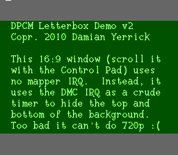

DPCM Letterbox
==============

This NES program demonstrates abusing the NTSC NES's sampled sound
playback hardware as a scanline timer to split the screen twice
without needing to use a mapper-generated IRQ.

How it works
------------
The NES has sample playback hardware that can trigger when it
finishes playing a differential pulse code modulated (DPCM) waveform.
There are eight samples to a byte, and a waveform is 16n + 1 bytes
long.  There are sixteen valid rates for sample playback, numbered 0
to 15, and DPCM rate 15 has 54 CPU cycles per sample, or
`54 * 3 * 8` = 1296 PPU dots per byte, or 3.8 scanlines per byte.
But the time between NMI and the first sample data fetch drifts from
frame to frame. So at the start of the frame, the program has to
measure exactly how far apart the CPU and PPU are, and then the IRQ
handler has to waste a corresponding amount of time before doing
raster effects.

This version has a slight visual artifact in the top overscan region
because it uses sprite 0 as a timing reference so that it can be used
even with an NMI handler whose execution time in CPU cycles varies.
A game whose NMI handler takes constant time would not need sprite 0;
it could use the end of the NMI handler as a reference.

    Reset handler:
      Set up screen data
      Enable IRQ
      Wait forever

    NMI handler:
      Set up sprite 0 hit at top of screen
      Disable sample playback
      Turn on background rendering at a fixed scroll position
      Wait for Sprite 0 off and on
      Turn off background rendering
      Clear number of elapsed IRQs
      Enable playback and IRQ
      Measure time until IRQ in 8-cycle units
      Convert this to an amount of time to waste
      Read the controllers
      Compute next scroll value

    IRQ handler:
      Add 1 to elapsed IRQs
      Restart sample playback
      If elapsed IRQs is at first threshold:
        Waste time in 8-cycle units
        Turn on background rendering
      If elapsed IRQs is at second threshold:
        Switch next sample playback to 17-byte mode
      If elapsed IRQs is at third threshold:
        Waste time in 8-cycle units
        Turn off background rendering

Legal
-----
The following license applies to the source code, binary code, and
this manual:
    
    Copyright 2010 Damian Yerrick
    Copying and distribution of this file, with or without modification,
    are permitted in any medium without royalty provided the copyright
    notice and this notice are preserved.  This file is offered as-is,
    without any warranty.
