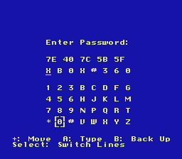

Password save
=============

By Damian Yerrick on 2010-07-21

Because nonvolatile solid-state memory was expensive in the NES days,
a lot of NES games would store their state in a password.  Even as
of 2010, nonvolatile memory is still expensive at the low volumes
typical of NES games developed by enthusiasts.  So I decided to
develop a password system for NES homebrew

Goals:

1. Record the player's achievements across a power cycle.
2. Make it difficult for the user to forge a password containing all
   achievements without either playing through the game or looking up
   on GameFAQs.
3. Detect and reject erroneous entries.

We use a 32-character alphabet including the symbols on a telephone
keypad (0-9, star, and pound) along with the Latin alphabet minus
vowels and S.  (Vowels run the risk of accidentally spelling an
obscene word, and S looks too much like a digit 5 even in lowercase.)
These are arranged in an order that makes sense on the entry screen
while adding a bit of complexity to casual cryptanalysis.

An 8-character password with a 32-symbol alphabet can store up to
40 bits.  This is 8 bits for a check value plus a 32-bit payload.
Achievements can be 1 bit (e.g. does the player have a given item)
or larger (e.g. how many chapters have been completed, or how much
cash is the player holding).

Encoding a password follows these three steps:

1. Append a constant to the 32-bit value to produce a 40-bit value.
2. Encrypt the password using a block cipher inspired by TEA.
3. Convert five 8-bit values to eight 5-bit values.

Decoding is the same steps in reverse:

1. Convert eight 5-bit values to five 8-bit values.
2. Decrypt the password.
3. Make sure the last byte of the value matches the constant.

This package includes code to encode a password, decode and validate
a password, and let the user enter a password.  Depending on the
`PW_SHOW_RAW` constant at the top of src/pw.s, the entry screen can
be built in a "debug" mode allowing encoding and decoding or in a
"game" mode allowing only decoding of valid passwords, with encoding
happening on a different screen.  Make sure to change the `PWKEY`
and `CHECK_BYTE` values in your own productions so that other games'
passwords don't work on yours.

* Build requirements: cc65, GNU Make
* Additional requirements to build the CHR ROM data: Python 3,
  Pillow (Python Imaging Library)

The file pw.c in the tools folder contains a reference implementation
of password encoding and decoding in C, which can be built with GCC.

Legal
-----
Short tech demo, no copyleft restrictions needed:

    Copyright 2010 Damian Yerrick
    
    Copying and distribution of this file, with or without modification,
    are permitted in any medium without royalty provided the copyright
    notice and this notice are preserved.  This file is offered as-is,
    without any warranty.
