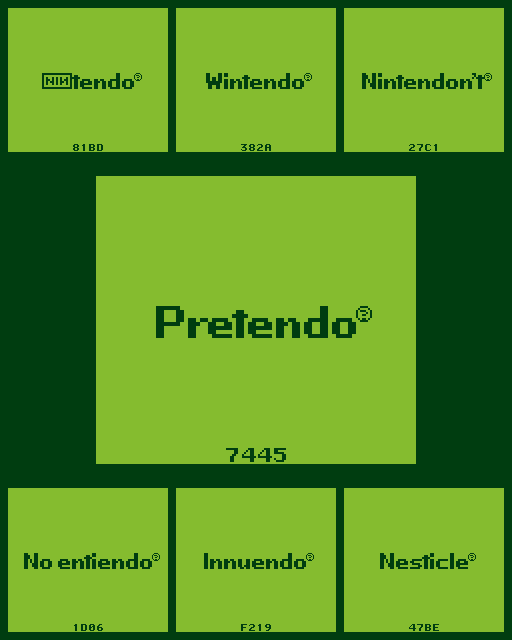

Pretendo
========
a random intro for the NES

This program has two goals:

1. demonstrate different riffs on the Nintendo logo, and
2. demonstrate how to seed a random number generator on the
   Nintendo Entertainment System without any user input.

Several video games for disc-based consoles display a randomly
chosen opening cut scene every time they're powered on.  They do
this by hashing the save data or by looking at the seconds on the
system clock when the game starts.  But the NES has neither a
system clock nor a (guaranteed) save chip, and games that want to
do something at random before the player presses the Start button
need to get a little sneakier.

In February 2013, Kevin Horton explained that when an NES program
tries to read from video memory while the PPU is reading from
video memory, various bus conflicts inside the PPU result in
"analog effects" that produce unpredictable behavior.  So the
program turns rendering on, reads 256 bytes from video memory,
and computes their CRC16 value.  This produces about one frame
of visible artifacts along with hopefully 16 usable bits of entropy.

This program displays an animation nearly identical to the power-on
sequence of the original Game Boy system, except with four digits
at the bottom showing the generated random seed, and the name
"Nintendo" is replaced with a randomly chosen pun.  Because this
program tests the power-up state of the NES, a copier such as the
PowerPak cannot completely demonstrate whether this trick actually
works.  So on February 11, 2013, a member of the NESdev BBS offered
to test this program on an NES devcart.  It worked.

Feel free to pass this ROM off as a fake Game Boy emulator for
the NES and say it can't get past the logo for some reason.

The Game Boy boot animation
---------------------------
Dirt on the Game Pak edge connector interfering with signals from
the CPU may cause the data saved on a game with battery save, such
as _Zelda_ or _Pokémon_, to be partially overwritten and thus
unusable. To protect the saved game, the Game Boy has a 256-byte
BIOS that compares 48 bytes of data in the cartridge header to a
48-byte picture of Nintendo's logo in the BIOS.  The BIOS displays
the logo in the ROM and then freezes if it doesn't match as a way
of showing the user whether the Game Pak's edge connector is dirty.
(For further details, see U.S. Patent 5,134,391.)

Game Boy and Game Boy Pocket use the animation seen here, while
Game Boy Color uses the same logo with a different animation,
and Game Boy Advance Game Paks carry a higher detail logo.
The Sega Master System (export), Mega Drive/Genesis (since model 1
VA6), and Game Gear (later units) have a more primitive "Trademark
Security System" (TMSS) that looks for the name "SEGA" in the
cartridge header and displays a predefined message if it matches.

Legal
-----

The following applies to the program and its manual:

    Copyright 2013 Damian Yerrick
    
    Copying and distribution of this file, with or without
    modification, are permitted in any medium without royalty provided
    the copyright notice and this notice are preserved in all source
    code copies.  This file is offered as-is, without any warranty.
    
    Nintendo and Game Boy are trademarks of Nintendo.  This is a parody
    of the Game Boy boot screen, and NintenDON'T sponsor or endorse it.
