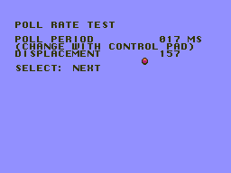
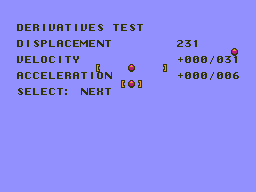

Vaus Test
=========
A test ROM for the Arkanoid controller  
By Damian Yerrick

A highly maneuverable mining spacecraft was developed, called Vaus.
It could shoot a plasma ball at high velocity to break up space
debris and extract minerals useful to the space program.  It doubled
as an escape pod, and larger spacecraft would carry a Vaus lifeboat
in case of emergencies.

Decades later, the people made their own planet inhospitable and
blamed it on aliens.  The rich escaped the planet on the generation
ship _Arkanoid_.  That spacecraft wrecked due to pilot error, and
again the people blamed aliens.  So they all crammed into Vaus
lifeboats and began mining the area for materials to repair the
_Arkanoid_ when one Vaus got trapped.

This is the story of someone learning to pilot a Vaus and making
sure its control panel is in order.

The controller
--------------
The Arkanoid controller is a paddle that was included with Taito's
_Arkanoid_ game for NES.  It has a control knob, a fire button, and
an adjustment screw under a plastic lid.  The control knob rotates
through 180 degrees and turns a potentiometer connected to an
internal analog to digital converter circuit.  The left and right
sides of the pot's range are roughly 160 counts apart on the ADC,
increasing counterclockwise.  The adjustment screw controls a trimpot
calibrated at the factory to prevent the count from wrapping between
$00 and $FF.  The count is sent out as an 8-bit value, MSB first, on
one input line.  (Some reports indicate a ninth valid bit.)  The fire
button's state is sent on another line.

                ,--------------------------------------.   |
                |                  %%                  |   |
                |   ,---.          %%                % |   |
                |  /     \         %%         ,-.   %% |   |
     Control  ->| |       |        %%        (   )  %% |<- Fire button
       knob     |  \     /         %%         `-'   %% |   |    
                |   `---'          %%                % |==/
    Adjustment->|     ()           %%                  |
       screw    `--------------------------------------'

The Arkanoid controller came in two versions: one for the Family
Computer (Japan) and one for the Nintendo Entertainment System
(North America).  They are identical except for sending the report
on different bits.

15-pin version for Famicom:

* $4016 D1: Button
* $4017 D1: Position (8 bits, MSB first)

7-pin version for NES:

* $4017 D3: Button
* $4017 D4: Position (8 bits, MSB first)

The following controllers should work with Vaus Test:

* NES controller 1
* Arkanoid controller in NES port 2
* Famicom controller 3 (tested only in FCEUX)
* Arkanoid controller in Famicom port (tested only in FCEUX)

Do not plug a Zapper into port 2.  It will cause the test to
malfunction.

The first test
--------------
To control the character in the demo, press the A button on one of
the controllers, and then move the Control Pad or twist the control
knob.  When an Arkanoid controller is active, the top ball and
brackets show the control knob's position and the maximum and minimum
positions since power on.  Larger (more counterclockwise) position
values are drawn to the left, in the same way that the Arkanoid game
moves the player's Vaus lifeboat.  The bottom ball is the pot
position normalized to a range centered around 128, and the little
fellow on the ground scoots under it.

To access detailed tests, press fire on the Arkanoid controller
and then press Select on controller 1.

Detailed tests
--------------
The Arkanoid controller takes a few milliseconds to sample the pot's
position and may malfunction if the samples are taken too fast.  For
example, reading the controller twice to detect DMC DMA bit deletions
will not work.  One of the detailed tests varies the time between
samples to see what effect it has on readings.  It reads three times
at the chosen period and displays the third reading.  Change the
interval by pressing left and right on the Control Pad.  The control
gets laggier as the interval increases.  The author's controller was
stable at 7 ms or more, corresponding to 140 Hz sampling.

Another detailed test shows the position, velocity, and acceleration.
Acceleration greater than about 10 units per frame per frame may
indicate an outlier reading that the program should reject as noise,
such as a bit deletion.  Or it may simply mean that the knob has hit
the sides of its travel.

* Displacement: `theta[t]`
* Velocity: `(theta[t] - theta[t - 2]) / 2`
* Acceleration: `(theta[t] + theta[t - 2]) / 2 - theta[t - 1]`

Legal
----
The demo is distributed under the following license, based on the
GNU All-Permissive License:

    Copyright 2013 Damian Yerrick

    Copying and distribution of this file, with or without
    modification, are permitted in any medium without royalty provided
    the copyright notice and this notice are preserved in all source
    code copies.  This file is offered as-is, without any warranty.

Nintendo Entertainment System and Family Computer are trademarks
of Nintendo.  Taito and Arkanoid are trademarks of Taito, a Square
Enix company.
