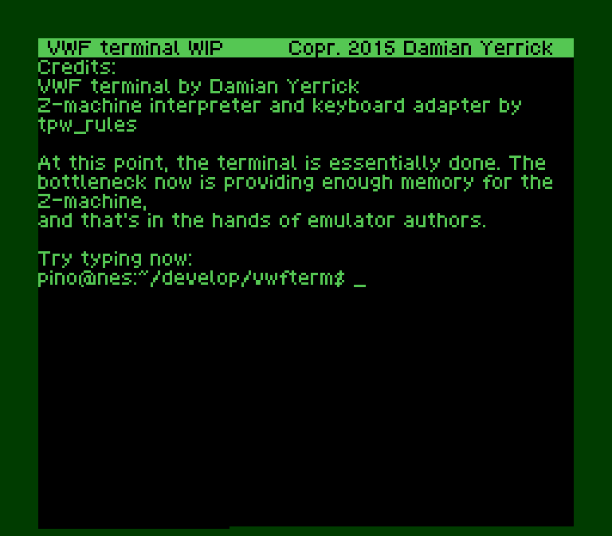

vwfterm
=======

This is a very basic terminal emulator useful for BASIC interpreters,
interactive fiction, and other programs for the Nintendo
Entertainment System using the keyboard adapter designed by
tpw_rules.

Features:

* 25 lines on NTSC or 30 lines on PAL NES or Dendy
* Each line is 224 pixels of proportional font
* Automatic word wrapping
* Fixed position status bar at top with activity throbber
* Can set one line of text in about 22,000 cycles
* VRAM uploads happen in the background through NMI and IRQ

It uses FME-7 interrupts to change CHR banks mid-screen.  For an
explanation of the display architecture, see `docs/boldly_going.md`.

Subroutines
===========

`term_init`
-----------
Sets up the terminal and clears the screen.

`term_cls`
-----------
Clears the screen.

`term_putc`
-----------
Writes the character in A to the terminal.  A should be a printable
ASCII character ($20-$7F) or a newline ($0A).  If a newline or word
wrap causes the bottom visible line of text to be filled, the scroll
is advanced to the next line.  Preserves Y; trashes $04-$0D.

`term_puts`
-----------
Writes the NUL-terminated string at address (A << 8 | Y) (AAYY) to
the terminal.  Trashes $04-$0D.  Returns $00-$01 pointing to the NUL
byte at the end of the string.

Usage example:

    lda #>hello_msg
    ldy #<hello_msg
    jsr term_puts

`term_puts0`
-----------
Writes the NUL-terminated string whose address is stored at $00-$01
to the terminal.  Trashes $04-$0D.  Returns $00-$01 pointing to the
NUL byte at the end of the string.

`term_flush`
------------
Writes the output buffer to the terminal without advancing to the
next line.  If A is nonzero, the line is drawn in inverse video
(white on black).  Trashes $04-$0D.

`term_discard_line`
-------------------
Clears the output buffer.  Useful for a message that has been
flushed with intent to replace, such as "MORE" in a pager.

`term_remeasure`
----------------
Recalculates the word wrap state.  Use this if you have modified
`term_buf` or `term_length` other than through `term_putc`.

`term_gets`
-----------
Collects characters entered by the user into a line of text.  It
calls `term_getc`, which you must provide, and responds to these
values returned in A:

* $20-$7F: Add this ASCII character at end of output buffer
* $08: Remove last character from output buffer
* $0D: Finish

The characters that have already been printed on this line before
the call to `term_gets` form the prompt.  The user cannot backspace
into the prompt.

`term_set_status`
-----------------
Replaces the text in the status bar with the NUL-terminated string at
address (A << 8 | Y) (AAYY).  The part before the first tab character
($09) is left-aligned; the rest is right-aligned.

Global variables
================

`tvSystem`
----------
Set by `term_init` to 0 for NTSC, 1 for PAL NES, or 2 for Dendy.

`last_PPUCTRL`
--------------
If bit 7 is true, the NMI handler will execute automatically.  This
NMI handler copies the last line of text to video memory and prepares
the IRQ engine to manage the screen display.

`term_buf`
----------
Output buffer containing ASCII characters.  It is not NUL terminated.
After `term_gets`, it contains the prompt followed by the input.

`term_length`
-------------
Total number of characters in `term_buf`, including the prompt and
the input.

`term_prompt_length`
--------------------
Number of characters in the prompt of `term_buf`.  After a call to
`term_gets`, this will equal the value that was in `term_length`
before the call.

`irq_handler`
-------------
2-byte vector to current IRQ handler.

`nmi_handler`
-------------
2-byte vector to current NMI handler.

`last_PPUCTRL`
--------------
If bit 7 is set, the `nmi_handler` gets called every NMI.

`nmis`
------
Low 8 bits of the number of NMIs that have occurred.  This is
incremented whether or not `last_PPUCTRL` is on.

`term_busy`
-----------
The NMI handler checks this every 16th time it runs (3 to 4 Hz),
sets it to zero, and updates a throbber at the right side of the
status line.  If `term_busy` was nonzero, the throbber is cycled
among frames of animation.  Otherwise, the throbber disappears.
Use this as a "watchdog" for your application's processing.

`cursor_y`
----------
This counts the total number of lines of text mod 30.

Legal
=====

The VWF terminal is distributed under the following terms:

    Copyright 2015 Damian Yerrick
    Copying and distribution of this file, with or without
    modification, are permitted in any medium without royalty
    provided the copyright notice and this notice are preserved.
    This file is offered as-is, without any warranty.
